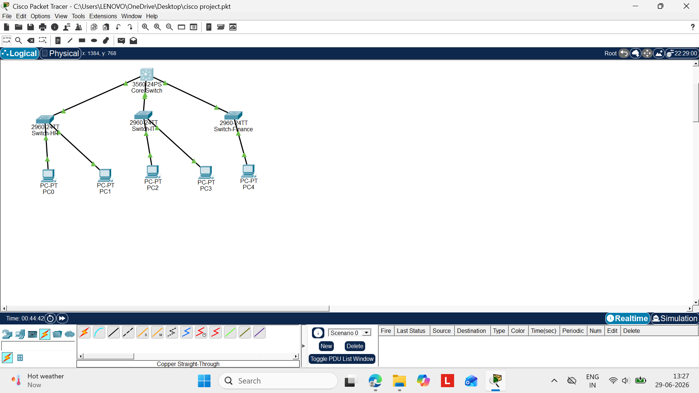
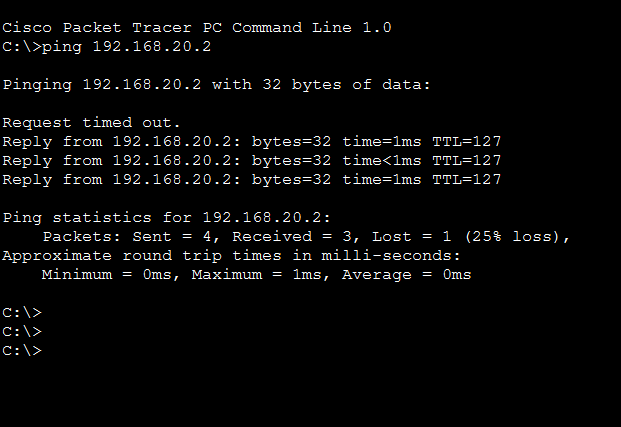

# Enterprise Campus Network Infrastructure Design

##  Project Overview
This project models a robust, scalable, and secure corporate campus network architecture designed for a multi-floor enterprise environment. Using Cisco Packet Tracer, the design separates departmental traffic into distinct virtual networks to optimize performance and enforce corporate security policies.

##  Network Architecture & Topology
The infrastructure utilizes a modern **collapsed-core design** featuring an access layer managed by a high-performance Layer 3 Multilayer Switch.

### Network Diagram

---

##  Implemented Features

* **VLAN Segmentation:** Traffic is completely isolated into separate broadcast domains for core corporate departments:
  * **VLAN 10 (HR):** Subnet `192.168.10.0/24`
  * **VLAN 20 (IT):** Subnet `192.168.20.0/24`
  * **VLAN 30 (Finance):** Subnet `192.168.30.0/24`
* **Inter-VLAN Routing:** Configured Switch Virtual Interfaces (SVIs) on a Cisco 3560 Multilayer Switch to allow controlled, high-speed routing between subnets.
* **Dynamic IP Allocation (DHCP):** Designed and deployed internal DHCP pools directly on the core layer switch to automate network configuration for end-user devices.
* **Access Control List (ACL) Security:** Enforced strict security standards using Extended Access Control Lists to block unauthorized traffic between sensitive departments (e.g., preventing HR from accessing the Finance subnet) while maintaining absolute network access for IT administrators.

---

## Verification & Proof of Work
The network was systematically tested using ICMP pings across distinct subnets. Below is the successful routing verification demonstrating cross-department communication functionality:

---

## How to Run the Project
1. Download and install **Cisco Packet Tracer**.
2. Clone or download this repository.
3. Open the `Enterprise-Campus-Network.pkt` file to view configurations, test real-time simulations, and inspect device CLIs.
